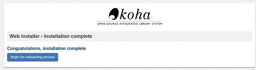

Als Folge der durch die Unkenntnis zu Git(hub) verursachte Verzögerungen im Unterricht wurde der Inhalt der ersten Übung verkürzt.
Wie der Titel schon sagt «TEIL 1: INSTALLATION – WIE MAN KOHA INSTALLIERT UND FÜR SCHULEN EINRICHTET», ging es in der Übung darum, den im Unterricht vorangegangen Installationsprozess voranzutreiben. Bei Koha handelt es sich um ein Bibliothekssystem, dass ausserdem noch open-source ist.
Viele der Befehle wurden im gemeinsamen Dokument im Unterkapitel «Installation von Koha 21.05» bereits ausgeführt. Deshalb galt es zuerst einen Überblick zu kriegen, bis zu welchem Schritt wir bereits fortgeschritten sind.
Da wir das Glück haben, mit einer VDI zu arbeiten, konnten wir damals mitten im Prozess die Verbindung unterbrechen und ebenso jetzt wiederaufnehmen. Mich begrüsste dabei folgendes:

Ich konnte in der Übung also direkt zum Unterkapitel «Bibliothek und erste Einstellungen einrichten» springen. Bei der Namensgebung für die Bibliothek habe ich mich zwar an das Kürzel gehalten, jedoch konnte ich mich nicht zurrückhalten, die Bibliothek «Alexandria» zu benennen.
