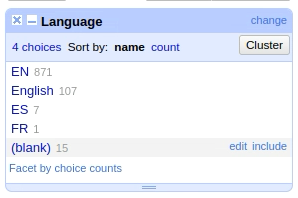

Heute lag der Schwerpunkt auf **OpenRefine**.

## OpenRefine

#### Claim von OpenRefine

>  "A free, open source, powerful tool for working with messy data"

* grafische Oberfläche, die einer klassischen Tabellenverarbeitungssoftware ähnelt
* dient der Analyse, Bereinigung, Konvertierung und Anreicherung von Daten
* wird in der Regel lokal auf einem Computer installiert und über den Browser bedient*1

***1 da hat und geholfen, denn bei einigen war die VM langsam und Herr Lohmeier konnte dann kurzerhand einen Server aufsetzen, für diese Personen.***

#### Einsatzbereiche


Note:
- Aus Umfrage vom OpenRefine-Team, n = 178

#### Von OpenRefine unterstützte Formate

* Besonders geeignet für tabellarische Daten (CSV, TSV, XLS, XLSX und auch TXT mit Trennzeichen oder festen Spaltenbreiten)
* Einfaches "flaches" XML (z.B. MARCXML) oder JSON ist mit etwas Übung noch relativ einfach zu modellieren
* Komplexes XML mit Hierarchien (z.B. EAD) ist möglich, aber nur mit Zusatztools
* Kann auch [in Kombination mit MarcEdit](https://blog.reeset.net/archives/1873) für Analyse und Transformation von MARC21 benutzt werden


OpenRefine hat [eine vorbildliche Open-Source Community ](https://github.com/OpenRefine/OpenRefine/graphs/contributors) (ganz anders als Marc Edit, wo wir am Abend davor gesehen haben).

---

### Installation OpenRefine 3.5.0 & Laden erster Daten

Mit dem ```wget``` Befehl konnten wir wieder eimmal die Software herunterladen. (``` wget https://github.com/OpenRefine/OpenRefine/releases/download/3.5.0/openrefine-linux-3.5.0.tar.gz```)
    
Mit ``` tar -xzf``` können wir die Datei entpacken. 

Nachdem wir OpenRefine installiert haben, und mittels ```./refine``` (vom entpackten Verzeichnis aus) gestartet haben, können wir unter http://localhost:3333 OpenRefine darauf zugreifen. Nach etwa sechs Sekunden ist OpenRefine verfügbar.

Praktischerweise können wir Daten auch über URL laden, mit der Option **Web Addresses (URL)**
Für die Übung benutzten wir: https://raw.githubusercontent.com/LibraryCarpentry/lc-open-refine/gh-pages/data/doaj-article-sample.csv

Das Laden dauerte nicht mehr als zwei Sekunden und schon werden diese als Tabelle dargestellt.

### Basisfunktionen 

**Facet / Filter:** "to select subsets of your data to act on"

Man kann einstesllen, wie viele Rows man sehen möchte. Ich könnte mir tatsächlich vorstellen, das auch in Zukunft zu benutzen, wenn ich ellenlange Excel Files zu bearbeiten / bewerten habe.

**Text Facet:** bei Spalte "Language" > Facet > Text Facet



werden dann links angezeigt und können ausgewählt werden.

Wir hatten z.B. den Umstand, dass beides "English" und "EN" steht. Glücklicherweise kann man direkt auf *edit* klicken, und bei allen 107 Zeilen anpassen lassen.
